# Mybatis笔记

官方文档

https://mybatis.org/mybatis-3/zh/java-api.html#sqlSessions

# MyBatis简介

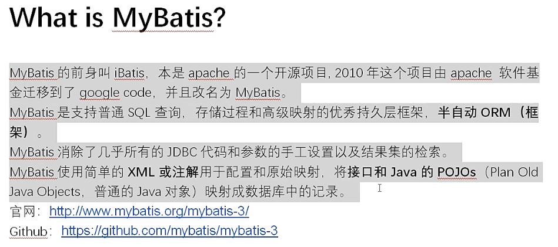

# 入门demo

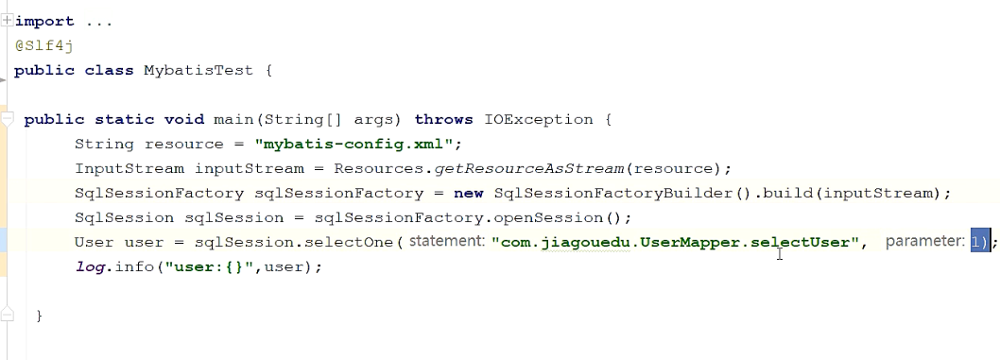

# 获取数据源

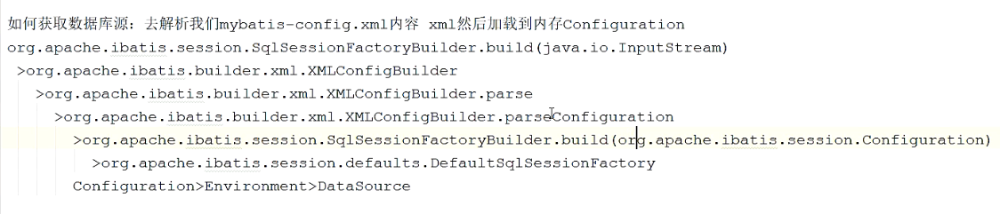

# 获取Mapper

## MapperProxy 动态代理

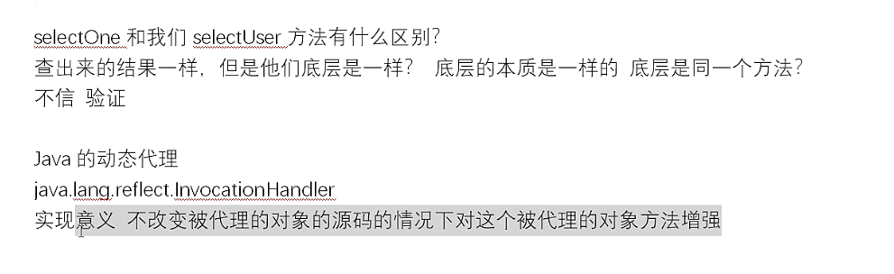

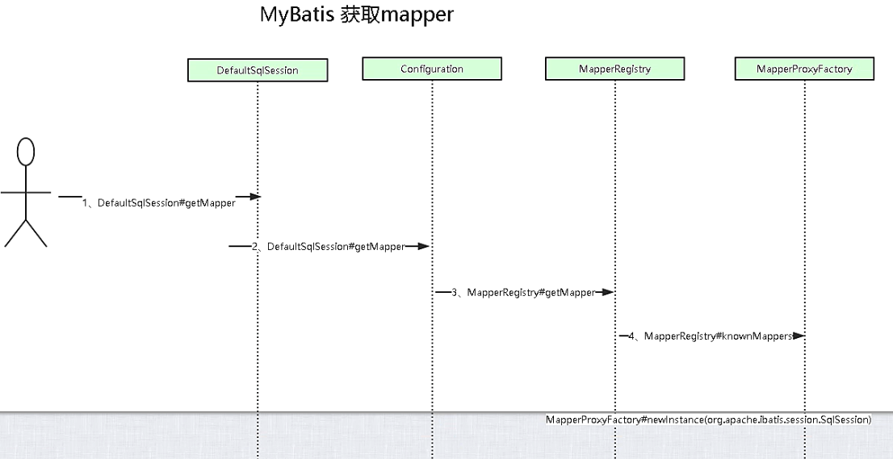

# 获取sql

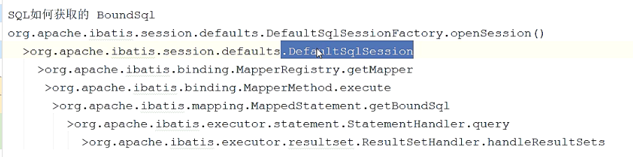

# Excutor  执行sql

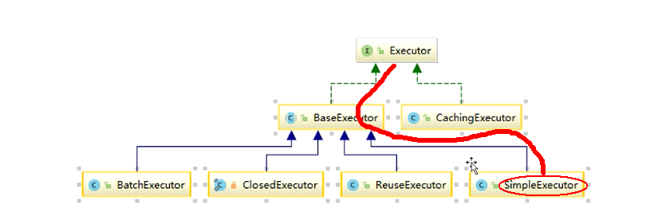

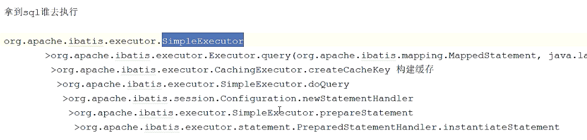

# 全流程图

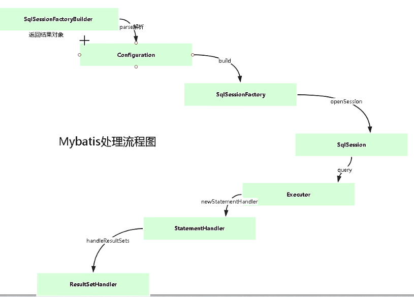

# MyBatis 缓存

Mybatis 使用到了两种缓存：一级缓存 本地缓存（local cache）和二级缓存（second level cache）。

CachingExecutor 就是一级缓存

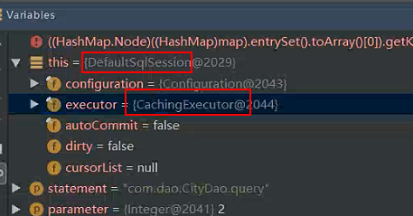

1）一级缓存 Mybatis的一级缓存是指SQLSession，一级缓存的作用域是SQlSession, Mabits默认开启一级缓存。 在同一个SqlSession中，执行相同的SQL查询时；第一次会去查询数据库，并写在缓存中，第二次会直接从缓存中取。 当执行SQL时候两次查询中间发生了增删改的操作，则SQLSession的缓存会被清空。 每次查询会先去缓存中找，如果找不到，再去数据库查询，然后把结果写到缓存中。 Mybatis的内部缓存使用一个HashMap，key为hashcode+statementId+sql语句。Value为查询出来的结果集映射成的java对象。 SqlSession执行insert、update、delete等操作commit后会清空该SQLSession缓存。

2）二级缓存 二级缓存是mapper级别的，Mybatis默认是没有开启二级缓存的。 第一次调用mapper下的SQL去查询用户的信息，查询到的信息会存放代该mapper对应的二级缓存区域。 第二次调用namespace下的mapper映射文件中，相同的sql去查询用户信息，会去对应的二级缓存内取结果。 如果调用相同namespace下的mapepr映射文件中增删改sql，并执行了commit操作，此时会情况该

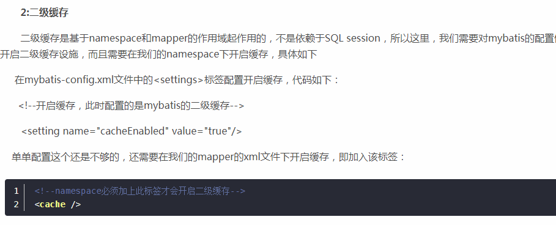

# 定位过的问题

1.注解方式，方法同名

2.borrow XXX failed

3.MapperProxy

4.数据源切换  ，JunitTest

# Mybatis

官方文档：

mybatis

spring-mybatis

http://mybatis.org/spring/zh/getting-started.html

# spring配置 数据源datasource和连接池 的7种方式

Spring内置数据源配置
Class:DriverManagerDataSource
全限定名：org.springframework.jdbc.datasource.DriverManagerDataSource
spring-jdbc.jar

apache的 dbcp数据源配置
Class : BasicDataSource
全限定名：org.apache.commons.dbcp.BasicDataSource
需要添加：com.springsource.org.apache.commons.dbcp-1.2.2.osgi.jar
com.springsource.org.apache.commons.pool-1.5.3.jar

c3p0的 数据源配置
Class：ComboPooledDataSource
全限定名：com.mchange.v2.c3p0.ComboPooledDataSource
需要添加：com.springsource.com.mchange.v2.c3p0-0.9.1.2.jar

spring-jdbc（非线程池模式）：DriverManagerDataSource

apache-DBCP：BasicDataSource

https://blog.csdn.net/weixin_39805338/article/details/81060142

https://blog.csdn.net/xhf852963/article/details/83622682

https://blog.csdn.net/qq_38408785/article/details/90440990

# learn

1、mybatis核心概念和源码流程

2、mybatis一级二级缓存

3、mybatis面试你可以拿满分

# What is MyBatis?

MyBatis的前身叫iBatis，本是apache的一个开源项目, 2010年这个项目由apache 软件基金迁移到了google code，并且改名为MyBatis。
 MyBatis是支持普通SQL查询，存储过程和高级映射的优秀持久层框架，**半自动ORM（框架）**。
 MyBatis消除了几乎所有的JDBC代码和参数的手工设置以及结果集的检索。
 MyBatis使用简单的**XML或注解**用于配置和原始映射，将**接口和Java的POJOs**（Plan Old Java Objects，普通的Java对象）映射成数据库中的记录。

官网：http://www.mybatis.org/mybatis-3/

Github：https://github.com/mybatis/mybatis-3

 

# 快速开始：

一、maven依赖

二、构建全局mybatis-config.xml

三、构建mapper

四、构建运行程序

 

 

# 看源码

小雷正确看源码方式：宏观》微观》画图（图解）

宏观：mybatis的本质是什么？

微观：

<mappers>

<mapper resource="mybatis/UserMapper.xml"/>

</mappers>

### Mybatis的加载mapper方式有多少种？

4种

selectOne和我们selectUser方法有什么区别？

查出来的结果一样，但是他们底层是一样？ 底层的本质是一样的 底层是同一个方法？ 是

DefaultSqlSession.java

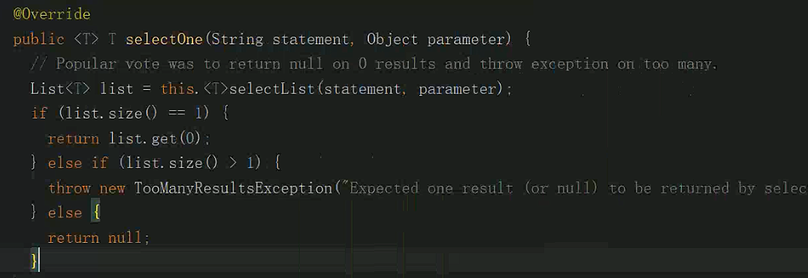

不信 验证

 

Java的动态代理

java.lang.reflect.InvocationHandler 

实现意义 不改变被代理的对象的源码的情况下对这个被代理的对象方法增强

 

 

Mybatis的一级缓存默认是开启还是关闭的？

cacheEnabled=true

一级缓存是干嘛的....

Mybatis执行器类图关系

 

PreparedStatement和Statement的区别 防止sql注入

# mybatis核心概念

**Configuration、SqlSessionFactory、Session、Executor、MappedStatement、StatementHandler、ResultSetHandler**

 

| **名称**          | **意义**                                                     |
| ----------------- | ------------------------------------------------------------ |
| Configuration     | 管理mysql-config.xml全局配置关系类                           |
| SqlSessionFactory | Session管理工厂接口                                          |
| Session           | SqlSession是一个面向用户（程序员）的接口。SqlSession中提供了很多操作数据库的方法 |
| Executor          | 执行器是一个接口（基本执行器、缓存执行器）  作用：SqlSession内部通过执行器操作数据库 |
| MappedStatement   | 底层封装对象  作用：对操作数据库存储封装，包括 sql语句、输入输出参数 |
| StatementHandler  | 具体操作数据库相关的handler接口                              |
| ResultSetHandler  | 具体操作数据库返回结果的handler接口                          |

 

# 整体认识mybatis源码包

​        ├─annotations  ->注解相关 比如select insert

​        ├─binding    -> mapper相关

​        ├─builder    ->解析xml相关

​        ├─cache    ->缓存

​        ├─cursor    -> 返回结果resultset

​        ├─datasourcer  ->数据管理 

​        ├─exceptionsr    -> 异常

​        ├─executorr    -> 执行器

​        ├─io       ->classloader

​        ├─jdbc       ->jdbc

​        ├─lang       ->jdk7 jdk8

​        ├─logging       ->日志相关

​        ├─mapping       ->mapper相关的封装

​        ├─parsing       ->xml相关解析

​        ├─plugin       ->拦截器

​        ├─reflection       ->反射相关

​        ├─scripting       ->数据厂家

​        ├─session       ->sessiomn

​        ├─transaction      ->事务

​        └─type         ->返回类型对应

 

 

 

 面试问题：

selectUser 与selectOne

mybatis一级缓存默认开启、但是使用spring-mybatis时候一级缓存失效，因为sqlSession交给spring处理，执行完成后sqlSession的connection被关闭

 

